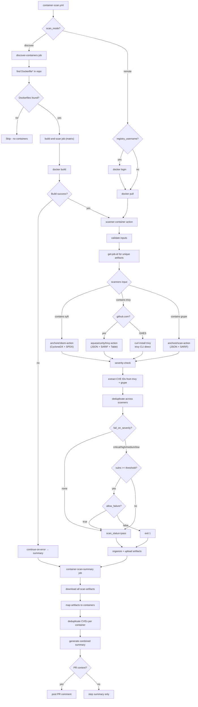

# Hardening Workflows Test Suite

Comprehensive test suite for [huntridge-labs/hardening-workflows](https://github.com/huntridge-labs/hardening-workflows) — validates the container security scanning composite actions and reusable workflows.

## What's Being Tested

| Component | Purpose |
|-----------|---------|
| `scanner-container` | Composite action: runs trivy, grype, syft on a single image |
| `scanner-container-summary` | Composite action: combines parallel scan results, deduplicates CVEs |
| `parse-container-config` | Composite action: generates matrix from `container-config.yml` |
| `container-scan.yml` | Thin wrapper workflow: discover (find Dockerfiles) or remote (scan existing images) |
| `infrastructure-scan.yml` | Reusable workflow for trivy-iac + checkov |
| `scn-detector` | Composite action (argus): IaC change classification for FedRAMP SCN |

## Dashboard

Test results are published to GitHub Pages with each run, showing:
- Current test status and pass rate
- Category breakdown (unit, remote, discover, actions, combination, scn, regression)
- Historical run data (last 20 runs)
- The exact commit SHA of the hardening-workflows being tested

## Execution Path



## Test Matrix (57 tests)

### Unit Tests — `test-unit.yml`

| # | Test | Validates |
|---|------|-----------|
| U1 | parse-container-config.test.js | Config parsing, schema validation, matrix generation |
| U2 | test-parse-trivy-results.sh | Trivy JSON to CVE extraction |
| U3 | test-parse-grype-results.sh | Grype JSON to CVE extraction |
| U4 | test-generate-container-summary.sh | Summary generation from scan results |
| U5 | GHES static analysis | No hardcoded github.com URLs in action logic |

### Remote Mode Tests — `test-remote.yml`

| # | Test | Image | Scanners | Severity | allow_failure | Expected | Category |
|---|------|-------|----------|----------|---------------|----------|----------|
| R1 | remote-vuln-all-scanners | nginx:1.19.0 | trivy,grype,syft | none | false | PASS, vulns found | TP-detect |
| R2 | remote-clean-image | distroless/static-debian12 | trivy,grype | none | false | PASS, no findings | TN-detect |
| R3 | remote-trivy-only | alpine:3.18 | trivy | none | false | PASS, trivy only | scanner isolation |
| R4 | remote-grype-only | alpine:3.18 | grype | none | false | PASS, grype only | scanner isolation |
| R5 | remote-syft-only | alpine:3.18 | syft | none | false | PASS, SBOM only | scanner isolation |
| R6 | remote-fail-critical | nginx:1.19.0 | trivy,grype | critical | false | PASS (1) | TP-threshold |
| R7 | remote-pass-none | nginx:1.19.0 | trivy,grype | none | false | PASS despite vulns | TN-threshold |
| R8 | remote-allow-failure | nginx:1.19.0 | trivy | high | true | PASS (bypassed) | allow_failure |
| R9 | remote-bad-image | nonexistent/nosuchimage:v0 | trivy | none | false | Graceful error | error handling |
| R10 | remote-clean-strict | distroless/static-debian12 | trivy,grype | low | false | PASS | TN-threshold |
| R11 | remote-threshold-precision | alpine:3.18 | trivy,grype | critical | false | PASS (no criticals) | TN-precision |
| R12 | remote-dedup-validation | nginx:1.19.0 | trivy,grype | none | false | PASS + dedup verified | dedup logic |

### Discover Mode Tests — `test-discover.yml`

| # | Test | Scanners | Severity | Expected |
|---|------|----------|----------|----------|
| D1 | discover-mixed | trivy,grype | none | Finds good + vulnerable, broken build skipped |
| D2 | discover-trivy-only | trivy | none | Single scanner in discover mode |
| D3 | discover-severity | trivy,grype | critical | Threshold applied to discovered containers |

### Direct Action Tests — `test-actions-direct.yml`

| # | Test | Config | Expected |
|---|------|--------|----------|
| A1 | config-single-public | tests/configs/single-public.yml | 1 entry, has_containers=true |
| A2 | config-multi-container | tests/configs/multi-container.yml | 3 entries, 6+ scan_matrix entries |
| A3 | config-structured-image | tests/configs/structured-image.yml | Image ref built from components |
| A4 | config-all-options | tests/configs/all-options.yml | Full schema: registry, auth, all flags |
| A5 | config-invalid-duplicate | tests/configs/invalid-duplicate.yml | Duplicate names rejected |

### Combination Tests — `test-combination.yml`

Pairwise coverage tests filling gaps in the parameter space (mode × scanners × severity × allow_failure × image).

| # | Mode | Scanners | Severity | allow_failure | Image | Gap filled |
|---|------|----------|----------|---------------|-------|------------|
| C1 | remote | trivy+syft | none | false | nginx:1.19.0 | Scanner pair TS |
| C2 | remote | grype+syft | none | false | nginx:1.19.0 | Scanner pair GS |
| C3 | remote | trivy | medium | false | nginx:1.19.0 | `medium` severity |
| C4 | remote | grype | high | false | nginx:1.19.0 | `high` standalone |
| C5 | remote | grype | critical | false | nginx:1.19.0 | Grype threshold |
| C6 | remote | trivy | low | false | alpine:3.18 | `low` on low-vuln |
| C7 | remote | trivy+grype | high | false | alpine:3.18 | `high` TN precision |
| C8 | remote | trivy+grype | critical | true | nginx:1.19.0 | Multi-scanner + allow_failure |
| C9 | remote | grype | low | true | distroless | grype + allow_failure + clean |
| C10 | discover | trivy | medium | true | — | discover + allow_failure |
| C11 | discover | grype | low | false | — | discover + grype only |
| C12 | discover | trivy+grype+syft | none | false | — | discover + all scanners |
| C13 | discover | syft | high | false | — | discover + syft only |
| C14 | remote | trivy+grype+syft | high | true | alpine:3.18 | All scanners + threshold + allow |
| C15 | remote | trivy+grype | medium | false | distroless | medium TN on clean |

### SCN Detector Tests — `test-scn-detector.yml`

Validates the [argus scn-detector](https://github.com/huntridge-labs/argus) action — classifies IaC changes into FedRAMP SCN categories (ROUTINE, ADAPTIVE, TRANSFORMATIVE, IMPACT).

| # | Test | IaC Format | Expected Category | Validates |
|---|------|-----------|-------------------|-----------|
| S1 | routine-tags | Terraform | ROUTINE | `tags.*` pattern match |
| S2 | routine-description | Terraform | ROUTINE | `description` pattern match |
| S3 | adaptive-instance-type | Terraform (modify) | ADAPTIVE | `instance_type` modify rule |
| S4 | adaptive-iam-attachment | Terraform | ADAPTIVE | `aws_iam_policy_attachment` create |
| S5 | transformative-iam-role | Terraform | TRANSFORMATIVE | `aws_iam_role` create |
| S6 | transformative-db-engine | Terraform (modify) | TRANSFORMATIVE | `aws_rds_*` engine modify |
| S7 | impact-encryption | Terraform (modify) | IMPACT | Encryption removal |
| S8 | impact-public-sg | Terraform | IMPACT | `0.0.0.0/0` ingress pattern |
| S9 | impact-iam-user | Terraform | IMPACT | `aws_iam_user` create |
| S10 | kubernetes-detection | Kubernetes | detected | K8s YAML format detection |
| S11 | cloudformation-detection | CloudFormation | detected | CFN YAML format detection |
| S12 | no-iac-changes | non-IaC | NONE | `has_changes=false` |
| S13 | fail-on-impact | Terraform | IMPACT (fails) | `fail_on_category=impact` enforcement |
| S14 | fail-on-adaptive | Terraform | ADAPTIVE (fails) | `fail_on_category=adaptive` enforcement |
| S15 | mixed-multi-category | Terraform (multi-file) | IMPACT | Highest category wins |

### Regression Tests — `test-suite.yml`

| # | Test | Validates |
|---|------|-----------|
| I1 | infrastructure-scan | trivy-iac + checkov still work |
| I2 | no-hardcoded-urls | No github.com URLs in action shell scripts |

## Quick Start

```bash
# Runs automatically on every push to main (concurrency: 1)
# Also runs weekly on Sunday 9am UTC

# Run full suite manually
gh workflow run test-suite.yml

# Run specific scope
gh workflow run test-suite.yml -f scope=unit
gh workflow run test-suite.yml -f scope=remote
gh workflow run test-suite.yml -f scope=discover
gh workflow run test-suite.yml -f scope=actions
gh workflow run test-suite.yml -f scope=combination
gh workflow run test-suite.yml -f scope=scn

# Monitor
gh run watch
```

## Repository Structure

```
.github/workflows/
  test-suite.yml             Orchestrator (push + dispatch + weekly)
  test-remote.yml            12 remote mode tests
  test-discover.yml          3 discover mode tests
  test-actions-direct.yml    5 composite action tests
  test-combination.yml       15 pairwise combination tests
  test-scn-detector.yml      15 SCN detector classification tests
  test-unit.yml              5 unit tests

.github/scripts/
  generate-dashboard.sh      Dashboard HTML generator

tests/
  dockerfiles/
    good/Dockerfile           FROM alpine:3.18
    vulnerable/Dockerfile     FROM node:14-slim (known CVEs)
    broken/Dockerfile         Invalid (tests error handling)
  configs/
    single-public.yml         1 public container
    multi-container.yml       3 containers, mixed scanners
    structured-image.yml      Structured image object format
    all-options.yml           Every config field populated
    invalid-duplicate.yml     Duplicate names (schema error)
```

## TP/TN Coverage Matrix

|  | Scanner finds vulns | Scanner finds nothing |
|--|--------------------|-----------------------|
| **Image IS vulnerable** | R1, R6, R8, R12 (True Positive) | Bug — caught by R1 assertion |
| **Image is clean** | Bug — caught by R2/R10 assertion | R2, R10 (True Negative) |

|  | Threshold triggers failure | Threshold allows pass |
|--|---------------------------|-----------------------|
| **Vulns meet threshold** | C3, C4, C5 internally (1) | Bug — caught by C3/C4/C5 |
| **Vulns below threshold** | Bug — caught by R11/C7 | R7, R10, R11, C7 (True Negative) |

## Pairwise Coverage

After the C-series combination tests, parameter pair coverage is:

| Parameter Pair | Coverage |
|---------------|----------|
| mode × scanners | 14/14 (100%) |
| mode × severity | 10/10 (100%) |
| mode × allow_failure | 4/4 (100%) |
| severity × allow_failure | 8/10 (80%) |
| scanners × severity | 19/35 (54%) |

Remaining gaps are syft-involving severity combos (meaningless — syft is SBOM-only, doesn't do vulnerability scanning).

**(1)** `container-scan.yml` uses `continue-on-error: true` on scan jobs, so the reusable workflow always returns `success` even when the `scanner-container` action triggers a severity failure internally. The threshold enforcement happens inside the action (`exit 1`), but the wrapper absorbs it. Tests validate the workflow completed; the severity check ran correctly inside.
